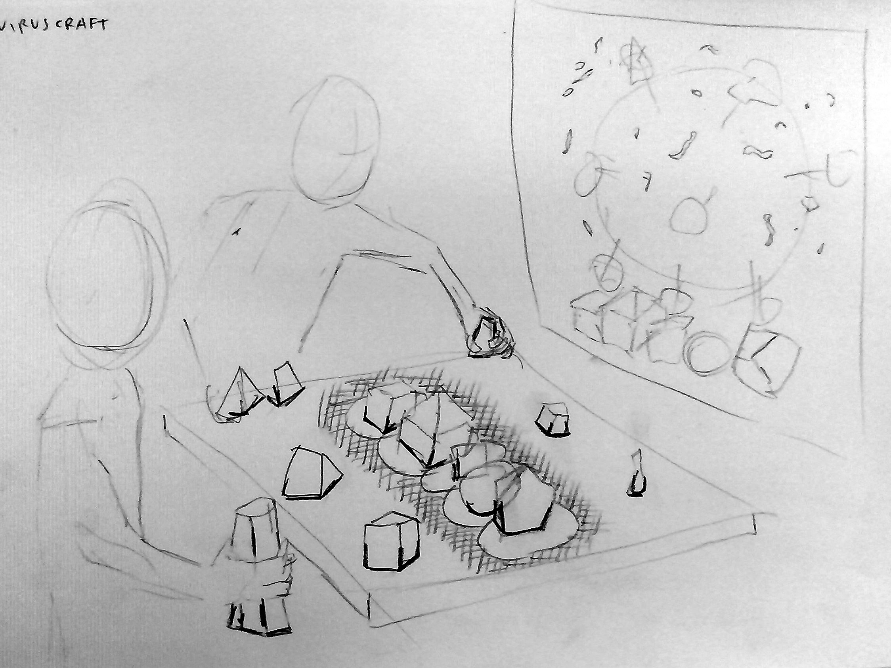

# Viruscraft

In this project we ask - what determines the ability of a virus to infect some hosts but not others? Working with evolutionary biologist Ben Longdon, we're developing a citizen science project using visual programming, craft, tangible interfaces and games to explore virus host shifts – where a virus jumps from one host species to another.

https://fo.am/viruscraft/
